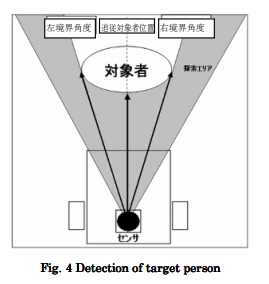
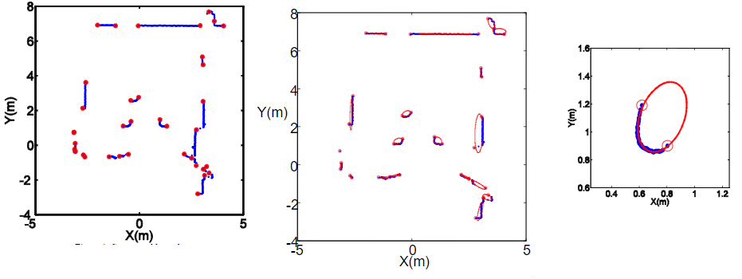

# 論文調査 5/25
- 頼りになる自動追従運搬ロボット【サウザー】
    - http://jp.doog-inc.com/product-thouzer.html
    - これの病院運用版を作成する。自分は追従対象の認識のみ

- 自動追従ショッピングカートの制御システムの実装と評価
    - http://www3.nit.ac.jp/~tamura/pdf/2010-0.pdf
    - LRS(LRF)を用いて対象を追従する。
    - 追従対象認知にはカメラも検討したが、画角が狭いため没。
    - 対象者の両脇の境界角度を求め，その中心角度を追従対象者位置とする手法を考案。  
    
    - ただし、他の人を追跡対象者として認識してしまう恐れがあるが、その対策は実装していない。
    - 実験はシミュレーター上

- レーザレンジファインダを用いた移動ロボットによる人の追跡
    - https://www.jstage.jst.go.jp/article/jrsj1983/24/5/24_5_605/_pdf/-char/ja
    - LRFで取得した値を俯瞰画像に変換し、その画像内にある人の脚を検知する。(下図の左上が俯瞰画像、右上が現実世界)
    - LRFを中心に、角度と距離ごと(下図の左下)に作成したパターン画像(下図の右下)を予め作成し、俯瞰画像からそのパターン画像とよく似ている部分を探し出す。ブロックマッチング。     
    
    - また、環境の変化によってとれるLRFの値は変化するため、その変化に対応できるようにパーティクルフィルターを用いている。

- Torso Detection and Tracking using a 2D Laser Range Finder(2DのLRFを用いた胴体検出と追跡)
    - https://pdfs.semanticscholar.org/c846/ba6b080803d2d2fd76301c5769e8654c3603.pdf
    - LRF一個とturtlebotの様なロボットを利用して胴体の検出、追従を行う。
    - LRFから得られるデータはデジタルなデータであるため、拡張カルマンフィルターを用いたデータ分割アルゴリズム(1)を用いて、下図のようにする。(多分)青点がLRFの値、赤丸が線の端。そこから楕円図を作成(2)、その楕円図が人であるかどうかクラス分類する。
    - クラス分類には数種類の分類器を用意した。LRFで用意した500のデータセットより、200のトレーニングデータと200のテストデータを用いて、用意した分類器の比較を行った結果、RBFSVM(Radial Basis Function Support Vector Machines)が採用された。
      
    - 参考文献  
    (1)Road Curb and Intersection Detection Using A 2D LMS https://ieeexplore.ieee.org/document/1041355/  
    (2)Direct Least Square Fitting of Ellipses https://www.microsoft.com/en-us/research/wp-content/uploads/2016/02/ellipse-pami.pdf

- Development of a Laser-Range-Finder-BasedHuman Tracking and Control Algorithmfor a Marathoner Service Robot(マラソンサービスロボットのためのレーザレンジファインダに基づくヒューマントラッキング制御アルゴリズムの開発)
    - https://ieeexplore.ieee.org/stamp/stamp.jsp?arnumber=6690173
    - マラソン中に荷物を持ってくれるサービスを提供するロボット。シチュエーションの通り、室外で実験を行っている。
    - 人を検出する位置は胸部。先行研究より、屋外のマラソンランナーを追跡するには胴体を検出するのが最善であると分かった(1)。
    - 胴体の特徴を抽出するために一クラス分類問題のSVDD algo-rithmを使う。よくadaboostが使われるが、今回の場合、SVDD algo-rithmの方が優れているためこちらを使った。
    - 下図より、G=Girth、W=Width、D=Depth、ΘとC=angle、E=Width/Girthである。この実験では5つの特徴(G、W、D、C、E)を用いてクラス分類する。
    - 下図の左上と左下はLRFから胴体を取得した時の図。青の丸い点はLRFから胴体をかたどった時の値。
    - 下図の中央下と右下は、SVDD algo-rithmによる分類を2次元で可視化したもの。青の丸い点は学習データを指す。赤色の線の外に分類されたデータは人以外のものと認識される。下図の右上にある表はテストデータのG、W、D、C、Eを表記したもの。
    
    - 参考文献  
    (1)Marathoner tracking algorithms for a high speed mobile robot https://ieeexplore.ieee.org/document/6094772/