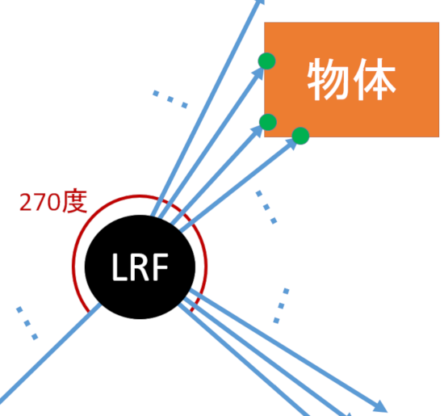
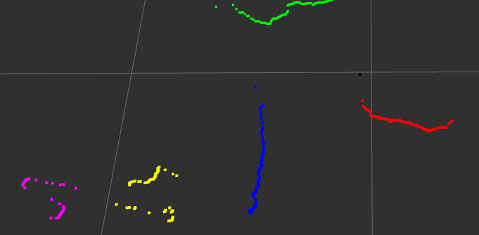
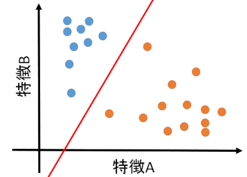
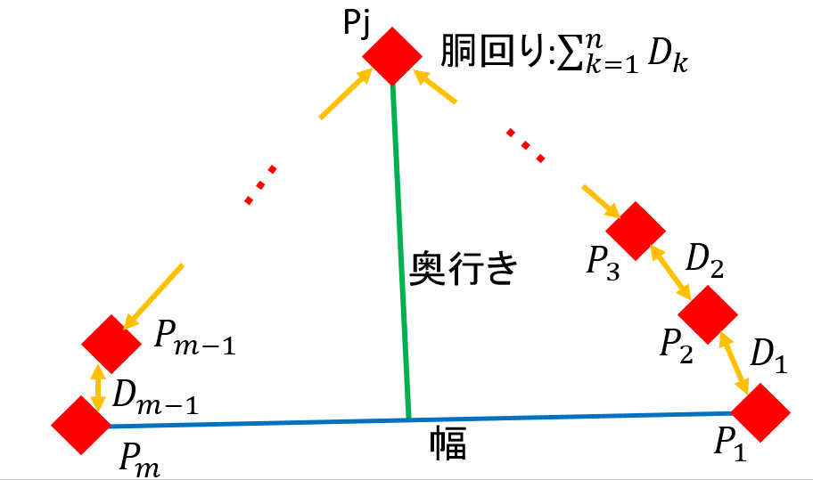
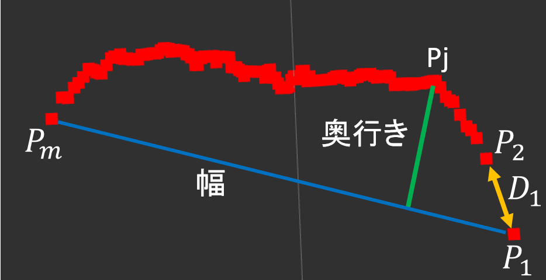

# 打ち合わせ 2018 6/22
## 活動状況
- LRFで取得した点群をクラスタリングによって分割し、RBFカーネルのSVMを用いた一クラス分類で分割した点群が人か人でないかを分別していた。
    - LRFで得られるデータは図1の緑点の座標である。LRFは自分を中心に270度方向にある壁や人などの物の距離を測ってくれる。ある角度ごとに図1の青矢印線のような測量レーザーを飛ばす。測量レーザーが物(例外有り)にあたった時、図1の緑点の座標を取得し、LRFのデータとして扱えるようになる。この資料では、この緑点を点、緑点が集まったデータを点群と呼ぶ。  
      
    図1 LRFで取得できるデータの説明図

    - クラスタリングは、データ同士の類似度をもとにデータをグループ化するデータ解析の手法である。この手法を使うことで、データ自身がどのようなクラスター（塊）から構成されているのかがわかり、データの構造に関するさまざまな知見を得ることができる。[1] 今回は、LRFで取得した点群の塊を見つけ、分割した。図2は分割した点群の塊ごとに色をつけている。黒色の点群は塊とみなされなかったもの。
      
    図2 クラスタリング

    - SVM(サポートベクターマシン)とは、特徴(例:物体の体積、幅、胴回りの長さ等‥)で構成された学習データを基にデータの種類を分ける物である。学習データと呼ばれるデータによって図3の赤線の様にデータの種類を決める境界線を決める。RBFカーネルを用いることで非線形な境界線を生成できる。1クラス分類は、あるデータが与えられたとき、そのデータが学習データと同じ様なデータであるかそうでないかを分類する手法である。  
      
    図3 SVM

    - 今回、3種類の特徴で構成された学習データを用いた。図4のP1からPmまでの距離である幅、PiとPi+1(iには整数が入る)の間の距離をDiとして、D1からDm-1までを足し合わせた胴回り、幅の青い直線とその線から最も遠いPiのまでの長さである奥行きの3種類である。図4の定義をLRFの点群に当てはめると図5のようになる。学習データは76個使った。  
      
    図4 定義

      
    図5 LRFの点群

- 胴体部分を検知する予定であったが、高さが足りなかったため腰を検知するようにした。設置高さは67.6cm、センサーの位置も含めると75か74cm程になる。
    - 学習データ(特徴を覚えさせるためのデータ)が胴体から腰に移っただけであるため、胴体を検知する時とプログラムは変わらない。
- 人と認識した物の方向を向いてその方向に進むようにTurtleBotを動かした。

## 問題点
- 人でないものを検知する。
    - 学習データを増やすか、特徴の種類を増やすことで、検知の精度を上げる。
- 人であるかどうかを検知するだけであるため、人が複数いる場合や人に似た形状がLRFに検知された場合、ロボットは追跡対象者を終えなくなる可能性がある。
    - 解決策として、追跡対象者の進行方向の予測を行い、その方向にいる人を追跡するという方法がある。パーティクルフィルタや拡張カルマンフィルタ等、いくつか予測方法がある。
    - 胴体ではなく、足の動きを検知させて進行方向を予測させる方法もある。歩行中の足に関して調べている論文もある。

## 今後の活動
- 6・7月は進行方向の予測手法を実装し、検知の精度を上げる調整を行う。

## 引用文献
- [1] クラスタリング - MATLAB & Simulink (6月21日閲覧)
  https://jp.mathworks.com/discovery/cluster-analysis.html