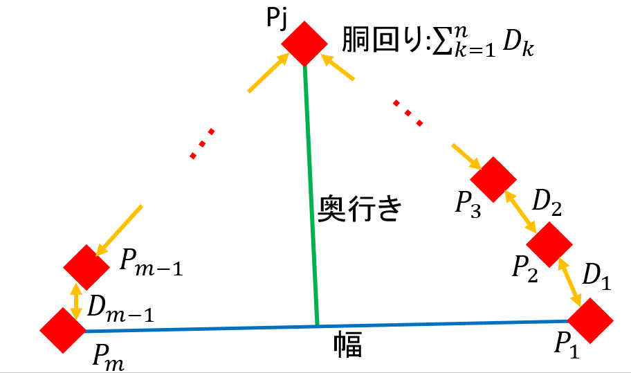

# 打ち合わせ 2018 8/1
## 活動状況
- カルマンフィルター  
観測値(エンコーダーやLRFなどの測定値)に含まれるノイズを排除して、本来の状態(座標値など)を割り出すもの。他にも、未来の予測を行うことが可能であるため、これを使って過去のLRFの測定値から追跡対象者の位置を推定する。

- カルマンフィルターを使ったプログラムは書けたが、まだカルマンフィルターに代入する値(設定値みたいなもの)をうまく調節できていないため、そこに関して調節する必要がある。ただし、以前のように複数の追跡対象者がいたとしても、コンピュータが誤検知するということは少なくなった。
- 奥行きを図る方法にプログラムのミスがあったため直した。

## 今後の予定
- 胴体を使った追跡方法だけでなく、足を使った追跡手法も試したいので、今後は並行して開発を進める予定。
- 手法の比較を行うための検知精度の測定方法を決める。